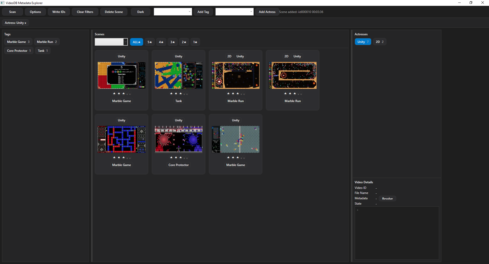
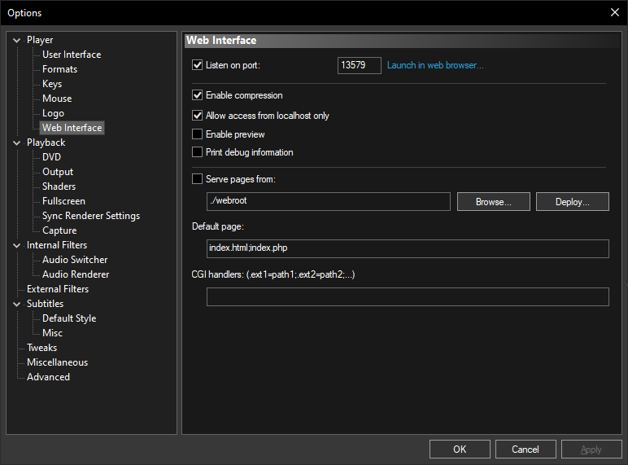

# VideoDB

VideoDB 是一個 Windows 本地影片 Scene Database 工具。

配合 MPC-HC 使用，可快速建立：

* Scene Bookmark
* Tag
* Actress
* Rating
* Timestamp
* Thumbnail Preview

並支援：

* 自動 Scan 影片庫
* Rename / Move File 自動修復
* Video ID Metadata Recovery
* Dark Mode UI

## Screenshot



---

# 功能特色

## F8 快速 Scene Capture

播放影片時：

1. 使用 MPC-HC 播放影片
2. 跳到想記錄的場景
3. 按下 F8
4. VideoDB popup 視窗會自動出現
5. 可快速加入：

   * Tag
   * Actress
   * Rating
   * Note

目前播放時間會自動記錄。

---

## 自動 Scene Thumbnail

如果放入：

```text id="9w7xl3"
ffmpeg.exe
```

VideoDB 會自動：

* 擷取 Scene 畫面
* 生成 WebP Thumbnail
* 顯示於 Scene List

---

## Video ID Metadata System

VideoDB 會將影片 ID 寫入影片 metadata stream。

即使：

* rename file
* move file
* 更改資料夾

只要影片仍在 Scan Folder 中：

VideoDB 就能自動找回：

* Scene
* Tag
* Actress
* Rating
* Event

避免資料遺失。

---

## Scan System

Scan Button 會：

* 掃描所有影片資料夾
* 匯入新影片
* 偵測 rename file
* 偵測 moved file
* 自動 reconnect existing database records

支援格式：

* MKV
* MP4
* AVI
* TS

---

# 系統需求

* Windows 10 / 11
* MPC-HC
* ffmpeg.exe（可選）

MPC-HC：

https://github.com/mpc-hc/mpc-hc

或者安裝：

K-Lite Codec Pack（Standard 版本包含 MPC-HC）

https://codecguide.com/download_kl.htm

FFmpeg：

https://ffmpeg.org/download.html

---

# 首次設定

## 1. 設定 MPC-HC 路徑

進入：

```text id="rq7qz6"
Options
```

選擇：

```text id="0mx22h"
mpc-hc64.exe
```

例如：

```text id="9x7m2u"
C:\Program Files (x86)\K-Lite Codec Pack\MPC-HC64\mpc-hc64.exe
```

---

## 2. 設定影片庫資料夾

在：

```text id="gmk8fq"
Options
```

加入影片資料夾。

Scan Button 會掃描這些資料夾。

---

## 3. 啟用 MPC-HC Web Interface

MPC-HC：

```text id="v44jlwm"
View → Options → Player → Web Interface
```

啟用：

```text id="9u95qx"
Listen on port: 13579
```

這是 F8 Scene Capture 必需功能。

---

# 使用方式

## 新增 Scene

1. 使用 MPC-HC 播放影片
2. 跳到想記錄的位置
3. 按 F8
4. 輸入：

   * Tag
   * Actress
   * Rating
   * Note

Scene 會自動加入資料庫。

---

## Scene Filter

可透過：

* Tag
* Actress
* Rating

快速篩選 Scene。

---

## Double Click Scene

Double Click Scene 後：

* MPC-HC 會自動播放
* 自動跳到對應時間

---

# 資料儲存

Database：

```text id="nzlsru"
video.db
```

Thumbnail：

```text id="8lhhpi"
thumbnails/
```

---

# 建議 Publish 設定

建議使用：

```text id="b3xqq2"
win-x64
self-contained
```

這樣使用者不需要另外安裝 .NET Runtime。

---

# 注意事項

目前版本仍屬 early alpha。

建議：

* 定期 backup video.db
* 不要直接修改 database
* Scan 前確認影片資料夾正常

---

# GitHub

Project Repository：

https://github.com/offerhouse/VideoDB
